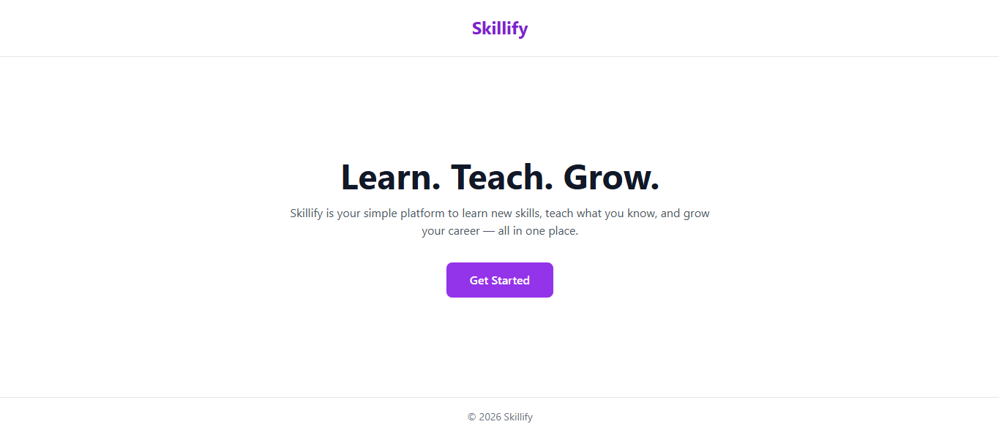
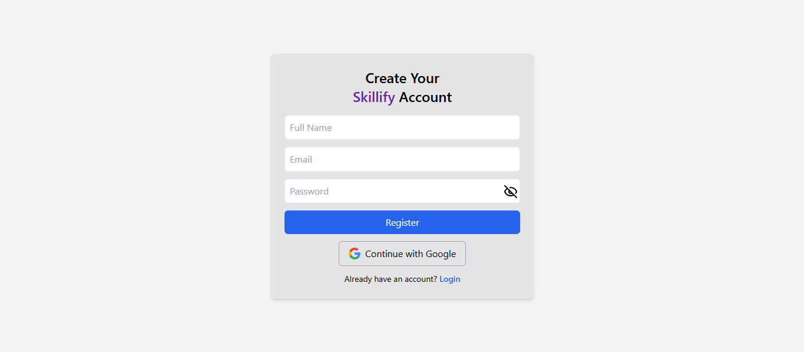
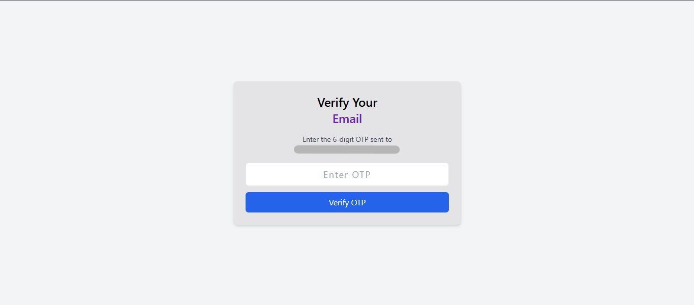
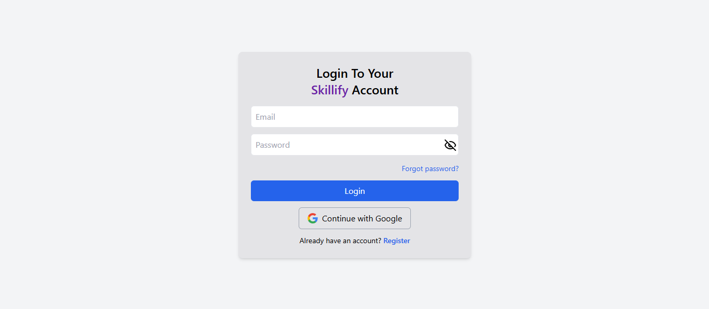
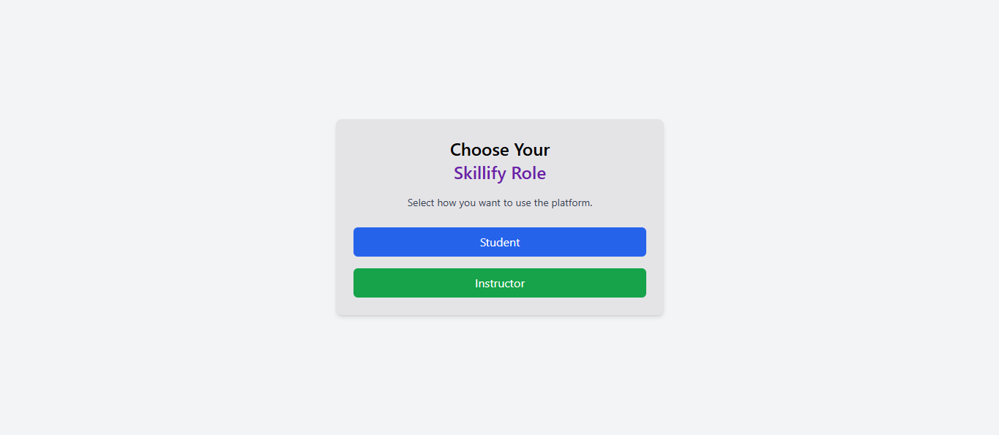
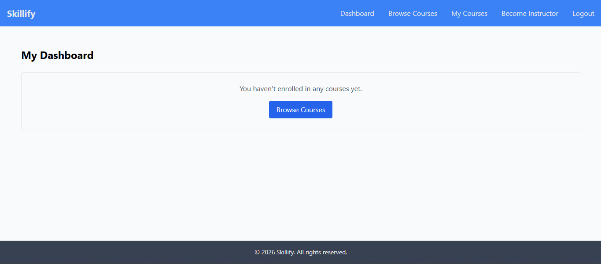

# Skillify - Frontend 🚀

<p align="center">
  
</p>

**Skillify** is a modern, responsive e-learning platform designed to bridge the gap between instructors and students. This repository contains the frontend code for the application, built with a focus on speed, user experience, and a clean aesthetic.

Part of a full-stack MERN (MongoDB, Express, React, Node.js) application.

---

## 🌟 Features

- **User Authentication:** Secure Login and Signup flows for both Students and Instructors.
- **Course Discovery:** Interactive dashboard to browse and search for available courses.
- **Responsive UI:** Fully optimized for Mobile, Tablet, and Desktop views using Tailwind CSS.
- **Dynamic Content:** Real-time data fetching and state management for a seamless experience.
- **Smooth Navigation:** Client-side routing for instant page transitions.

## 🛠️ Tech Stack

- **Framework:** [React.js](https://reactjs.org/)
- **Build Tool:** [Vite](https://vitejs.dev/)
- **Styling:** [Tailwind CSS](https://tailwindcss.com/)
- **Icons:** [Lucide React](https://lucide.dev/)
- **Routing:** [React Router DOM](https://reactrouter.com/)
- **API Client:** [Axios](https://axios-http.com/)

---

## 🚀 Getting Started

Follow these steps to set up the project locally on your machine.

### Prerequisites

- **Node.js** (v16 or higher recommended)
- **npm** or **yarn**

### Installation

1. **Clone the repository:**

   ```bash
   git clone https://github.com/Sandipan3/skillify-frontend.git
   cd skillify-frontend
   ```

2. **Install dependencies:**

   ```bash
   npm install
   ```

3. **Set up environment variables:**
   Create a `.env` file in the root directory and add your backend API URL:

   ```env
   VITE_API_URL=your_backend_api_endpoint
   ```

4. **Run the development server:**
   ```bash
   npm run dev
   ```

The application will be running at `http://localhost:5173`.

---

## 📁 Project Structure

```text
skillify-frontend/
├── public/                    # Static assets
├── src/
│   ├── api/                   # Axios base URL configuration
│   ├── components/            # Reusable UI components
│   ├── pages/                 # Application pages
│   ├── router/                # Route configuration
│   ├── schema/                # Validation schemas
│   ├── slice/                 # Redux slices
│   ├── store/                 # Redux store setup
│   ├── utils/                 # Utility functions
│   ├── App.jsx                # Root React component
│   ├── index.css              # Global styles
│   └── main.jsx               # Application entry point
├── .env.example               # Example environment variables
├── .gitignore                 # Git ignore rules
├── eslint.config.js           # ESLint configuration
├── index.html                 # Vite HTML template
├── LICENSE                    # MIT License
├── tailwind.config.js         # Tailwind configuration
├── postcss.config.js          # PostCSS configuration
├── vite.config.js             # Vite configuration
├── package.json               # Project metadata and dependencies
└── package-lock.json          # Dependency lock file
```

---

## 🤝 Contributing

1. Fork the Project
2. Create your Feature Branch (`git checkout -b feature/AmazingFeature`)
3. Commit your Changes (`git commit -m 'Add some AmazingFeature'`)
4. Push to the Branch (`git push origin feature/AmazingFeature`)
5. Open a Pull Request

---

## 🚀 Getting Started (User Flow)

You can explore the live application here:
👉 **https://skillify-frontend.netlify.app/**

Follow the steps below to get started with Skillify.

---

### Open the Landing Page

Visit the live site and click **Get Started** to begin.

<p align="center">
  
</p>

---

### Register a New Account

If you are a new user, click **Register**.

- Sign up using **Email & Password** (OTP verification required), **or**
- Continue with **Google**

<p align="center">
  
</p>

---

### Verify OTP

Users who register with email/password must verify the OTP sent to their email.

<p align="center">
  
</p>

---

### Login to Your Account

After successful registration, proceed to the login page.

- Enter your credentials, **or**
- Continue with Google

<p align="center">
  
</p>

---

### Select Your Role

Choose your role to continue.
(In this demo, **Student** is selected.)

<p align="center">
  
</p>

---

### Access the Dashboard

After role selection, you will be redirected to the user dashboard.

<p align="center">
  
</p>

---

## Notes

- Google authentication skips OTP verification.
- Email/password users must complete OTP verification before login.

## License

Distributed under the MIT License.

## Author

**Sandipan Jha**

- GitHub: [@Sandipan3](https://github.com/Sandipan3)
